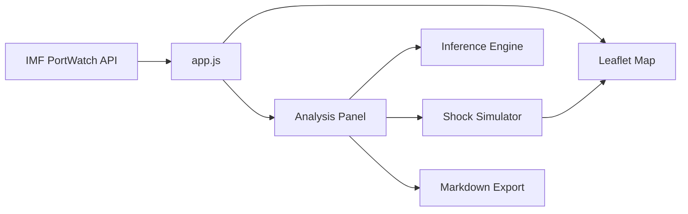

# 🚢 IMF PortWatch API Explorer & Geopolitical Shock Simulator

[](https://developer.mozilla.org/en-US/docs/Web/HTML)
[](https://developer.mozilla.org/en-US/docs/Web/JavaScript)
[](https://tailwindcss.com/)
[](https://leafletjs.com/)
[](https://portwatch.imf.org/)
[](https://pages.github.com/)

A **data-dense, open-source macroeconomic monitoring tool** built with pure vanilla web technologies. TankerMap ingests automated satellite AIS data from the [IMF PortWatch](https://portwatch.imf.org/) platform to map global tanker flows, assess port strategic vulnerabilities, and simulate major supply chain disruptions—such as closing the **Suez Canal** or **Strait of Hormuz**—with real-time algorithmic economic inference generation.

> **No build step. No framework. No backend.** Clone, serve, and deploy.

---

## ✨ Core Features

| Module | Description |
| --- | --- |
| **🗺️ Live Mapping** | Interactive Leaflet map with ~2,000+ global port nodes, CartoDB Dark Matter basemap, and circle markers scaled by observed tanker vessel density. |
| **🧠 Dynamic Economic Inference Engine** | Click any port to generate tiered macroeconomic narratives based on throughput (Primary Hub · Regional Node · Feeder Port) with congestion risk scoring. |
| **🎯 Strategic Vulnerability Index** | Haversine-distance analysis against five monitored chokepoints (Suez, Panama, Hormuz, Bab el-Mandeb, Malacca) with Low → Critical vulnerability scoring. |
| **⚡ Geopolitical Shock Simulator** | Toggle chokepoint closures to instantly escalate dependent ports to **CRITICAL (DISRUPTED)**, flash map markers, and inject crisis alerts into live analysis text. |
| **🔎 Data Filtering & Sorting Suite** | Slice the fleet by region, risk level, and sort metric—map markers and global aggregate stats update in real time. |
| **📄 Client-side Markdown Report Exporter** | One-click export of the full scenario state (filters, closures, stats, port narrative) to `portwatch-scenario-report.md`. |
| **📚 Economic Methodology Drawer** | Built-in documentation primer covering nowcasting theory, chokepoint vulnerability, and Cape of Good Hope rerouting economics. |

---

## 🏗️ Tech Stack

| Layer | Technology |
| --- | --- |
| **Structure** | HTML5 semantic layout |
| **Styling** | Tailwind CSS (CDN) + custom `styles.css` |
| **Mapping** | Leaflet.js 1.9.4 |
| **Logic** | Vanilla JavaScript (IIFE, no bundler) |
| **Data** | IMF PortWatch ArcGIS REST FeatureServer API |
| **Deployment** | Static hosting (GitHub Pages) |

### Data Sources

| Endpoint | Purpose |
| --- | --- |
| `PortWatch_ports_database` | Port geometry, continent, `vessel_count_tanker` |
| `Daily_Ports_Data` | Daily tanker port-call activity records |

---

## 🚀 Quick Start

### Prerequisites

- A modern web browser (Chrome, Firefox, Safari, or Edge)
- Any local static file server *(required—browsers block cross-origin API `fetch` from `file://`)*

### 1. Clone the repository

```bash
git clone https://github.com/<your-username>/TankerMap.git
cd TankerMap
```

### 2. Run a local server

Choose any option below:

```bash
# Python 3
python -m http.server 8080

# Node.js (npx, no install)
npx serve .

# PHP
php -S localhost:8080
```

Open **`http://localhost:8080`** in your browser.

### 3. Explore the dashboard

1. Wait for port markers to load on the global map.
2. Click a port marker for economic inference in the left panel.
3. Use **Data Filters** to isolate risk profiles by region.
4. Toggle chokepoints in the **Geopolitical Shock Simulator**.
5. Export a scenario report or open **Economic Methodology** for theory context.

---

## 🌐 Deploy to GitHub Pages

TankerMap is a **static site**—all files live at the repository root. Deployment takes under two minutes.

### Option A — GitHub UI *(recommended)*

1. Push this repository to GitHub.
2. Go to **Settings → Pages**.
3. Under **Build and deployment**, set:
   - **Source:** `Deploy from a branch`
   - **Branch:** `main` · `/ (root)`
4. Save. Your site will be live at:

   ```
   https://<your-username>.github.io/TankerMap/
   ```

### Option B — GitHub Actions *(optional)*

No workflow file is required for a root-level static site. GitHub Pages serves `index.html` directly.

---

## 📁 Project Structure

```
TankerMap/
├── index.html      # Application shell, sidebar layout, methodology drawer
├── app.js          # Map init, API fetch, inference engine, filters, export
├── styles.css      # Custom overrides, animations, drawer & simulator UI
└── README.md       # You are here
```

---

## 🧪 How It Works



1. **Fetch** — Port geometries and tanker counts are pulled from IMF GeoServices on load.
2. **Render** — Circle markers are sized by `vessel_count_tanker` and bound to click handlers.
3. **Analyze** — Nearest-chokepoint distance and throughput tiers drive vulnerability scores and narrative text.
4. **Simulate** — Closing a chokepoint re-scores dependent ports and updates map styling instantly.
5. **Export** — Current filter, simulation, and selection state is serialized to Markdown client-side.

---

## ⚠️ Disclaimer

TankerMap is an **open-source educational and scenario-analysis tool**. Economic narratives are algorithmically generated heuristics—not official IMF forecasts, investment advice, or policy guidance. Data © [IMF PortWatch](https://portwatch.imf.org/).

---

## 🤝 Contributing

Issues and pull requests are welcome. This project intentionally stays dependency-free—please avoid introducing build tooling unless there is a compelling reason.

---

## 📜 License

Released for open-source use. See repository license file for terms.
